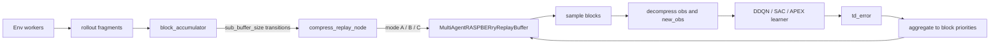

# RASPBERry

**R**eplay with **A**synchronous compre**S**sed **P**rioritized **B**lock **E**xperience **R**epla**y**.

RASPBERry is a replay-buffer research project built on [Ray RLlib](https://docs.ray.io/en/latest/rllib/index.html). It compares three buffer families under a shared training scaffold:

- **PER**: RLlib's standard prioritized replay.
- **PBER**: block-based prioritized replay without compression.
- **RASPBERry**: block-based prioritized replay with `blosc` compression and asynchronous worker support.

The current repository centers on `runner/run_*_algo.py` scripts, `configs/experiments/**` experiment configs, and replay-buffer implementations under `replay_buffer/`.

## Overview

RASPBERry changes the replay path in three ways:

1. It accumulates transitions into fixed-size blocks with `sub_buffer_size`.
2. It stores and samples priorities at block granularity.
3. It optionally compresses `obs` and `new_obs` before the block enters replay storage.

### Buffer Variants

| Buffer | Class | Role |
| --- | --- | --- |
| `PER` | `MultiAgentPrioritizedReplayBuffer` | RLlib baseline |
| `PBER` | `MultiAgentPrioritizedBlockReplayBuffer` | Block replay without compression |
| `RASPBERry` | `MultiAgentRASPBERryReplayBuffer` | Block replay with compressed observations |

### Compression Modes

| Mode | Meaning | Notes |
| --- | --- | --- |
| `A` | synchronous compression | Compress on the training path |
| `B` | batch synchronous compression | Compress in batches with blocking collection |
| `C` | asynchronous compression | Use Ray workers with bounded in-flight tasks |

## RASPBERry Schematic



`PBER` follows the same block path without compression. `PER` bypasses the block accumulator entirely and uses RLlib's built-in replay buffer.

## Current Entry Points

The main runnable entry points are the scripts in `runner/`:

| Algorithm | PER | PBER | RASPBERry |
| --- | --- | --- | --- |
| DDQN | `runner/run_ddqn_per_algo.py` | `runner/run_ddqn_pber_algo.py` | `runner/run_ddqn_raspberry_algo.py` |
| SAC | `runner/run_sac_per_algo.py` | `runner/run_sac_pber_algo.py` | `runner/run_sac_raspberry_algo.py` |
| APEX-DQN | `runner/run_apex_per_algo.py` | `runner/run_apex_pber_algo.py` | `runner/run_apex_raspberry_algo.py` |

The repository also contains historical or placeholder directories such as `old/` and `trainers/`. They are not the primary path for current runs. Use `scripts/launch_*_configs.sh` only as thin scheduling wrappers around the `runner/` entry points.

## Repository Layout

```text
RASPBERry/
├── algorithms/              # Custom RLlib algorithm overrides for block replay variants
├── configs/
│   ├── templates/           # Base templates per algorithm family
│   ├── experiments/         # Recommended per-env experiment configs
│   └── runtime.yml          # Local machine-specific runtime config (not versioned)
├── docs/                    # Project memory, architecture notes, test planning
├── metrics/                 # Iteration JSON dumping, MLflow helpers, logger setup
├── models/                  # Custom SAC image model (`SACLightweightCNN`)
├── replay_buffer/           # PER/PBER/RASPBERry buffer implementations
├── runner/                  # Primary training entry points
├── scripts/                 # Thin config schedulers for local multi-run launches
├── tests/                   # Existing tests, including legacy cases under cleanup
├── utils/                   # Env creation, config loading, data helpers
└── old/                     # Historical experiments and archived code paths
```

## Setup

### Prerequisites

- Linux
- Conda
- CUDA 12.1+ if you want to use the pinned GPU build from `environment.yml`

### Installation

```bash
git clone <repo-url> RASPBERry
cd RASPBERry
conda env create -f environment.yml
conda activate RASPBERRY
```

### Local Runtime Configuration

The runners expect a local `configs/runtime.yml`. In the current workspace this file is intentionally machine-specific and not tracked by git.

Minimal shape:

```yaml
paths:
  log_base_path: "/path/to/logs"
  ray_temp_dir: "/path/to/ray_tmp"

ray:
  object_store_memory_gb: 80
  include_dashboard: false

mlflow:
  tracking_uri: "http://127.0.0.1:9999"
```

## Configuration Model

The current config flow is:

1. `configs/templates/*.yml`: algorithm-level defaults.
2. `configs/experiments/{algo}/{buffer}/{env}.yml`: environment and buffer overrides via `extends`.
3. `configs/experiments/seeded/{algo}/{buffer}/{env}_seedN.yml`: main-run seed overlays.
4. `configs/experiments/edge/{algo}/{buffer}/{env}_seedN.yml`: edge-class seed overlays.
5. `configs/experiments/sub/*.yml`: block-size ablation overlays.
6. `configs/runtime.yml`: local runtime settings injected by `utils.ConfigLoader`.

Example:

```yaml
extends: ../../../templates/ddqn_base.yml

env_config:
  id: "Atari-BreakoutNoFrameskip-v4"
  env_alias: "DDQN-RASPBERry-Breakout"

hyper_parameters:
  replay_buffer_config:
    type: MultiAgentRASPBERryReplayBuffer
    capacity: 1000000
    sub_buffer_size: 8
    compression_mode: "C"
```

For new experiments, prefer `configs/experiments/**`. The flat top-level configs in `configs/` are still present, but they mainly serve as convenience or legacy entry files.
For reproducible scheduled runs, prefer the seed overlay configs rather than injecting seeds from a launch script. Each seed overlay fixes `hyper_parameters.seed`, appends the seed to `env_alias`, and records the seed in MLflow tags.

## Run Experiments

### Examples

```bash
# DDQN + RASPBERry on Breakout
python runner/run_ddqn_raspberry_algo.py \
  --config configs/experiments/seeded/ddqn/raspberry/breakout_seed0.yml \
  --gpu 0

# SAC + PBER on CarRacing
python runner/run_sac_pber_algo.py \
  --config configs/experiments/seeded/sac/pber/carracing_seed0.yml \
  --gpu 0

# APEX-DQN + PER on Pong
python runner/run_apex_per_algo.py \
  --config configs/experiments/seeded/apex/per/pong_seed0.yml \
  --gpu 0
```

### What the runners do

Each runner script is responsible for:

- loading experiment config plus local runtime config,
- creating and registering the environment,
- binding the selected replay buffer,
- initializing Ray and optional MLflow tracking,
- training in a loop and writing throttled `result_*.json` files.

### Launch Wrappers

For repeated local runs, use the thin launch wrappers in `scripts/`. These wrappers only schedule explicit config files onto GPU slots; they do not generate seeds, mutate configs, activate conda, or inject environment-specific runtime settings.

```bash
# Inspect the planned DDQN schedule without launching.
scripts/launch_ddqn_configs.sh -y -n 0,1 -j 2 \
  configs/experiments/seeded/ddqn/per/pong_seed0.yml \
  configs/experiments/seeded/ddqn/pber/pong_seed0.yml \
  configs/experiments/seeded/ddqn/raspberry/pong_seed0.yml

# Launch APEX configs one task per GPU.
scripts/launch_apex_configs.sh -n 0,1 -j 1 -f /path/to/apex_configs.txt

# Use an explicit Python executable instead of relying on the active shell.
scripts/launch_sac_configs.sh -p /home/seventheli/conda/envs/RASPBERRY/bin/python \
  -n 0 -j 1 configs/experiments/seeded/sac/pber/lunarlander_seed0.yml
```

Wrapper options:

- `-n GPU_IDS`: comma-separated GPU IDs, for example `0,1,2`.
- `-j TASKS_PER_GPU`: concurrent tasks per GPU slot.
- `-f CONFIG_LIST`: text file with one config path per line; blank lines and `#` comments are ignored.
- `-p PYTHON`: Python executable; otherwise `$PYTHON_BIN` or `python` is used.
- `-y`: dry-run schedule check.

Algorithm-specific wrappers reject configs from the wrong algorithm family. If any launched task exits nonzero, the wrapper reports the failing PID/config and exits nonzero after the current wave finishes.

## Supported Environment Families

`utils.env_creator()` currently supports the following environment families:

| Prefix | Observation style | Examples |
| --- | --- | --- |
| `Atari-` | image | `Atari-BreakoutNoFrameskip-v4`, `Atari-PongNoFrameskip-v4` |
| `BOX2DI-` | image | `BOX2DI-CarRacing-v2` |
| `BOX2DV-` | vector | `BOX2DV-LunarLander-v2` |
| `MUJOCOV-` | vector | `MUJOCOV-Walker2d-v4` |
| `MUJOCOI-` | image | MuJoCo image-observation variants |
| `MiniGrid-` | image | `MiniGrid-DoorKey-8x8-v0`, `MiniGrid-LavaCrossingS9N1-v0` |

## Outputs and Tracking

- Result snapshots are written as `result_*.json` in the run log directory according to `logging_config.result_json_freq`.
- Replay-buffer statistics are attached under `result["buffer"]` when available.
- MLflow metric logging is optional and controlled by `run_config.use_mlflow` plus `configs/runtime.yml`; metric frequency is controlled by `logging_config.log_freq`.
- If `hyper_parameters.seed` is set, runners pass it through RLlib config, print it in the startup log, and record it as an MLflow param and tag.
- MLflow artifacts are uploaded as one final zip archive at run shutdown by default. Intermediate full-directory artifact uploads are intentionally avoided to keep S3/object-store traffic coarse-grained.
- Checkpoint-like directories are excluded from the final archive unless `include_checkpoints_in_archive: true` is set in the MLflow runtime config.
- S3/object-store injection stays outside experiment YAML: configure it on the MLflow tracking server or the launch environment, for example with `MLFLOW_S3_ENDPOINT_URL`, `AWS_ACCESS_KEY_ID`, `AWS_SECRET_ACCESS_KEY`, and `AWS_DEFAULT_REGION`. Runners only call MLflow artifact APIs; `final_artifact_path` is an MLflow artifact subpath, not a bucket URI.

## Repository Notes

- `runner/` is the current execution layer.
- `trainers/` is currently an empty legacy placeholder, so older trainer-centric notes should not be treated as current guidance.
- `scripts/` contains launch wrappers only; experiment semantics still live in `runner/` and `configs/experiments/**`.
- `old/` contains historical experiments and archived implementations.

## License

See [LICENSE](LICENSE).
