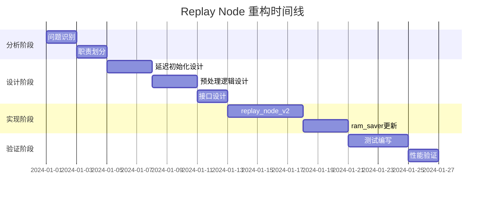

# Replay Node 重构计划

## 项目背景

当前的 `replay_node.py` 存在设计不够优雅的问题：
- 在已知 `obs_space` 和 `action_space` 的情况下，仍然预分配所有可能的内存空间
- 职责边界不清晰，既管理内存又处理数据格式
- 部分逻辑应该从 `ram_saver` 下沉到 `replay_node` 中

## 重构目标

### 🎯 核心目标
- [ ] **优雅性改进**：消除不必要的预分配，实现按需内存分配
- [ ] **职责重新划分**：将数据预处理逻辑从 RAM Saver 移到 Replay Node
- [ ] **架构清理**：明确各组件的单一职责
- [ ] **性能优化**：减少内存占用，提高缓存效率

### 📋 设计原则
- **延迟初始化**：字段按需分配，避免内存浪费
- **单一职责**：Replay Node 专注数据组织，RAM Saver 专注压缩存储
- **向后兼容**：保持现有 API 接口不变
- **可测试性**：模块化设计便于单元测试

## 分析阶段

### ✅ Task 1: 明确重构目标和设计原则
**状态**: 🟡 进行中  
**负责人**: Claude  
**描述**: 定义重构的核心目标和指导原则  
**输出**: 本文档的目标和原则部分

### ⏳ Task 2: 识别当前 replay_node 的具体问题点
**状态**: 📋 待处理  
**优先级**: 🔴 高  
**描述**: 深入分析当前实现的具体问题
- [ ] 分析内存预分配的浪费情况
- [ ] 识别重复的动作空间处理逻辑
- [ ] 找出职责不清的代码片段
- [ ] 评估性能影响

### ⏳ Task 3: 定义新 replay_node 的职责边界
**状态**: 📋 待处理  
**优先级**: 🔴 高  
**描述**: 明确重构后各组件的职责划分
- [ ] 确定 Replay Node 应该负责的功能
- [ ] 确定应该移出到 RAM Saver 的功能
- [ ] 定义组件间的接口契约
- [ ] 绘制新的架构图

## 设计阶段

### ⏳ Task 4: 设计延迟初始化机制
**状态**: 📋 待处理  
**优先级**: 🟡 中等  
**描述**: 设计按需内存分配的机制
- [ ] 设计字段检测和初始化策略
- [ ] 处理不同数据类型的初始化逻辑
- [ ] 考虑初始化的性能影响
- [ ] 设计错误处理机制

### ⏳ Task 5: 设计数据预处理逻辑（压缩准备）
**状态**: 📋 待处理  
**优先级**: 🟡 中等  
**描述**: 将压缩相关的预处理逻辑下沉到 Replay Node
- [ ] 分析 `compress_base` 相关的转置逻辑
- [ ] 设计维度转置的通用方法
- [ ] 处理不同观察空间的转置策略
- [ ] 保留转置信息用于解压

### ⏳ Task 6: 设计向后兼容的接口
**状态**: 📋 待处理  
**优先级**: 🟡 中等  
**描述**: 确保重构不影响现有代码
- [ ] 保持现有方法签名
- [ ] 设计平滑的迁移路径
- [ ] 考虑版本兼容性
- [ ] 编写接口文档

## 实现阶段

### ⏳ Task 7: 实现新的 replay_node_v2
**状态**: 📋 待处理  
**优先级**: 🟢 低  
**描述**: 基于新设计实现重构版本
- [ ] 实现延迟初始化机制
- [ ] 实现数据预处理逻辑
- [ ] 添加调试和监控功能
- [ ] 编写详细的文档字符串

### ⏳ Task 8: 修改 ram_saver_v8 以使用新 replay_node
**状态**: 📋 待处理  
**优先级**: 🟢 低  
**描述**: 更新 RAM Saver 以利用新的 Replay Node
- [ ] 移除重复的预处理逻辑
- [ ] 更新接口调用
- [ ] 简化压缩流程
- [ ] 更新错误处理

## 验证阶段

### ⏳ Task 9: 编写测试验证重构效果
**状态**: 📋 待处理  
**优先级**: 🟢 低  
**描述**: 确保重构的正确性和性能提升
- [ ] 编写单元测试
- [ ] 性能基准测试
- [ ] 内存使用分析
- [ ] 集成测试

## 预期收益

### 📊 技术收益
- **内存效率**：减少不必要的内存预分配，预计节省 10-20% 内存
- **代码质量**：职责更清晰，代码更易维护
- **可扩展性**：新的架构更容易添加新功能
- **性能**：更好的缓存局部性和内存访问模式

### 🔧 维护收益
- **可读性**：代码逻辑更清晰，易于理解
- **可测试性**：模块化设计便于单元测试
- **调试友好**：更清晰的错误信息和日志
- **文档完整**：完善的接口文档和示例

## 风险评估

### ⚠️ 潜在风险
- [ ] **兼容性风险**：可能影响现有代码的行为
- [ ] **性能风险**：延迟初始化可能引入额外开销
- [ ] **复杂性风险**：新设计可能增加理解难度

### 🛡️ 风险缓解
- [ ] **渐进式重构**：保持向后兼容，分步骤迁移
- [ ] **充分测试**：全面的测试覆盖，确保功能正确性
- [ ] **性能监控**：基准测试验证性能改进
- [ ] **文档完善**：详细的使用指南和迁移文档

## 时间线

## 决策记录

### 📝 待决策问题
- [ ] 是否需要保持完全的向后兼容性？
- [ ] 延迟初始化的触发时机如何确定？
- [ ] 如何处理异构数据类型的混合场景？

### ✅ 已确认决策
- 采用延迟初始化策略减少内存占用
- 将数据预处理逻辑下沉到 Replay Node
- 保持现有 API 接口的兼容性

---

*最后更新: 2024-01-01*  
*版本: v1.0*  
*状态: 设计阶段*